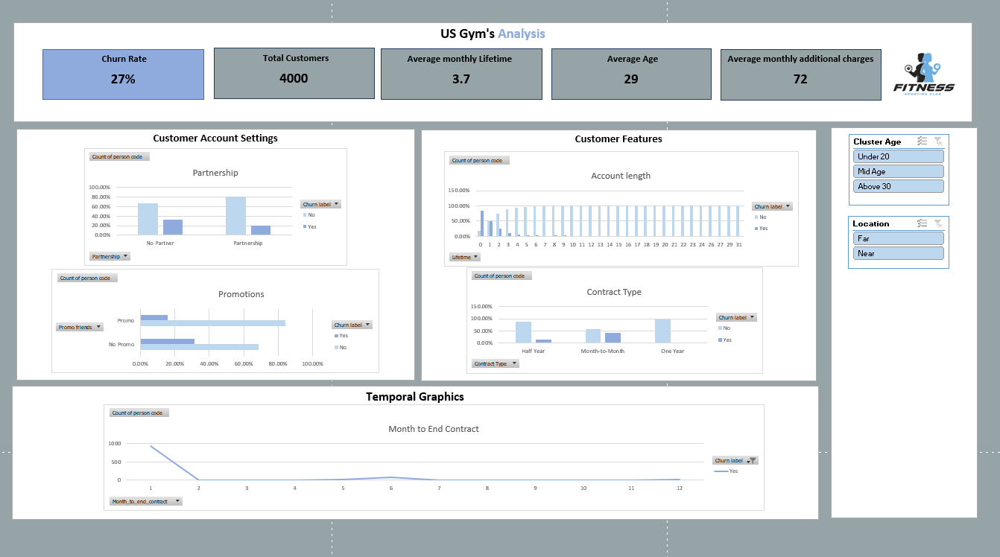

**Gym project**

<div style="text-align: center;">
     
</div>

### **Objetivo del proyecto**

- El objetivo principal de este proyecto es predecir la probabilidad de cancelación de membresía de los clientes para el mes siguiente, identificar perfiles clave de usuarios y desarrollar recomendaciones específicas que mejoren la retención y satisfacción del cliente. 
- Para ello, se analiza un conjunto de datos de membresías de gimnasio, explorando patrones de comportamiento como los tipos de membresía y el tiempo que los usuarios llevan suscritos al gimnasio.
- Este análisis permite obtener información valiosa para optimizar la experiencia del cliente, fortalecer su lealtad y apoyar la toma de decisiones estratégicas en la gestión del negocio. 


### **Descripción de las columnas relevantes:**

El conjunto de datos incluye diversas variables relevantes para analizar la cancelación de membresías “churn”. 
- La columna Churn indica si el cliente canceló su membresía en el mes actual (1=canceló). 
- Gender muestra el género del usuario (1=hombre, 0=mujer). 
- Near_Location señala si el cliente vive o trabaja cerca del gimnasio. 
- Partner identifica si trabaja en una empresa asociada al gimnasio (lo cual puede influir en descuentos o beneficios). 
- Promo_friends indica si el usuario se unió al gimnasio mediante una promoción de referidos usando el código de un amigo. 
- Lifetime representa la antigüedad del cliente en el gimnasio, medida en meses. 
- Month_to_end_contract refleja los meses restantes en su contrato actual. 
- Finalmente, avg_class_frequency_current_month muestra la frecuencia promedio con la que el cliente asistió a clases durante el mes en curso.

Variable Objetivo
- La variable objetivo corresponde a la columna 'churn' cancelación de los clientes que se pretende pronosticar para mejorar la retención de los mismos.
6 características son binarias (0-1)  se pasan la mayoría a categóricas


### Dashboard

<div style="text-align: center;">
     
</div>

### Directorio

```bash
Gym_Project/

|---Data/      #Carpeta con los archivos utilizados
|  |
|  |---Dataraw/    #Resultados del análisis descriptivo
|  |
|  |  |---gym_churn_us.xlsx
|  |
|  |---Data_transformed/        #Carpeta con el archivo dashboard final
|  |
|  |  |---gym_churn_us_tranfs.xlsx
|  |
|  |---Data_raw/        #Datos originales sin procesar
|  |
|---IMG/       #Imégenes para documentación y presentación
|  |
|  |---logo.webp
|  |---dashboard.png
|  |
|---Notas/        #Carpeta con los documentos resumen de cada sesión
|  |
|  |---EDA.docx
|  |
|___README.md
```

### Primeras conclusiones
• Los clientes que tienden a cancelar su suscripción suelen ser menores de 35 años.
• Los clientes que permanecen más tiempo son aquellos que contratan servicios adicionales por un valor aproximado de 500 USD.
• Las cancelaciones son más frecuentes entre usuarios a quienes les queda solo 1 o 6 meses de contrato.
• A partir de los 7 meses de antigüedad, los clientes muestran mayor tendencia a continuar en el gimnasio.
• Aquellos que cuentan con convenios empresariales (partnership) y, por lo tanto, acceden a mejores precios, presentan una menor tasa de cancelación.
• Los usuarios que ingresaron mediante un código de descuento también muestran una mayor retención.
• Los contratos mes a mes son los que registran la mayor cantidad de cancelaciones.

### Conclusiones
Se observa que los clientes que se unen al gimnasio mediante una recomendación de un amigo o a través de convenios con su empresa tienen una mayor probabilidad de permanecer activos y no cancelar su suscripción. 
Sin embargo, esto también podría indicar que muchas personas están esperando descuentos para inscribirse, y que quienes pagan la tarifa completa tienden a no quedarse mucho tiempo. Esto puede deberse a dos posibles razones: o bien las tarifas mensuales son demasiado altas en relación con lo que ofrecemos, o los usuarios no pueden mantener ese gasto durante un periodo prolongado. Podría ser que nuestros precios resulten demasiado elevados para el perfil económico de nuestros clientes actuales.

